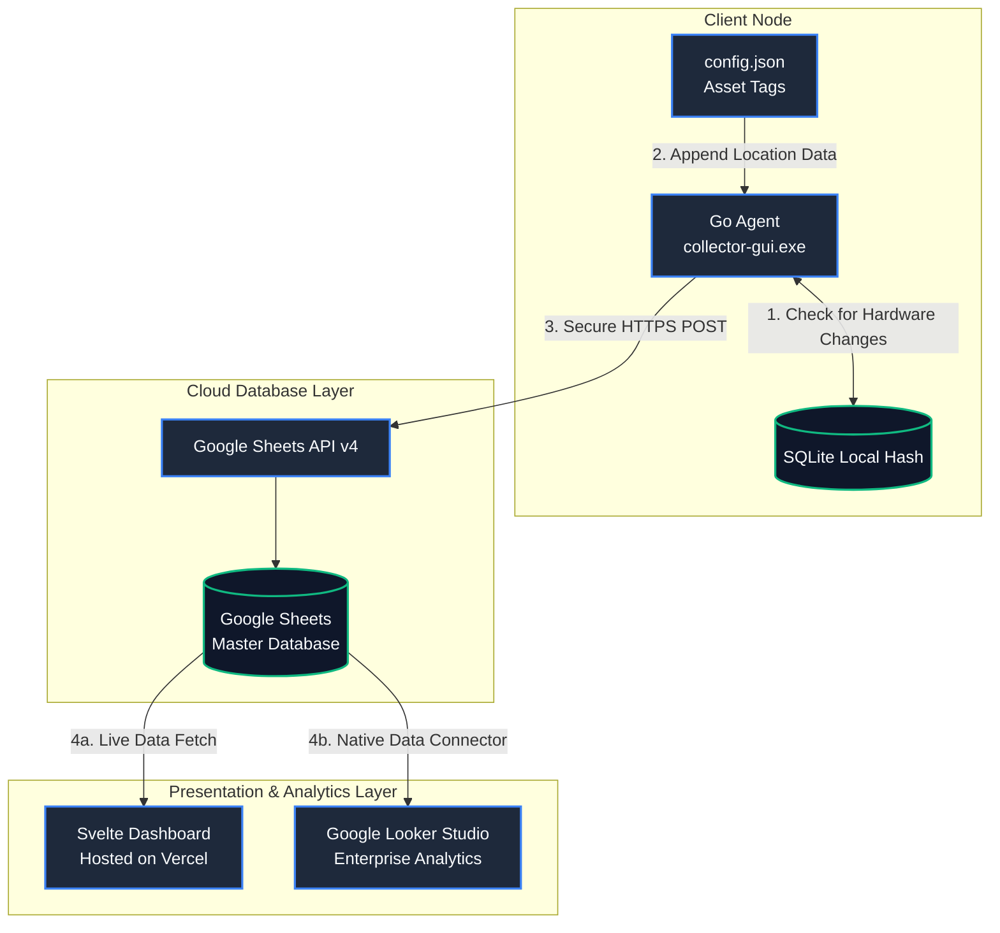

# PC Asset Tracker

A comprehensive IT asset management solution designed for automated hardware inventory and centralized monitoring. This project features a high-performance collection agent built with Go and a modern web-based dashboard developed with Svelte.

## 📊 Live Project Links

| Component | URL |
| :--- | :--- |
| **Interactive Dashboard** | [pc-tracker-ui.vercel.app](https://pc-tracker-ui.vercel.app) |
| **Google Looker Studio Report** | [View Analytics Report](https://lookerstudio.google.com/s/r480m8LFc4w) |
| **Raw Data Source** | [Google Sheets Sample Data](https://docs.google.com/spreadsheets/d/1WK_dJKXyquSS0xivuej8Ic8WxPDBLpYsSvUVVFP3eM8/edit?usp=sharing) |

---

## 🏗️ Architecture & Data Flow



---

## 🛠️ Technical Stack

* **Backend & Agent:** Go (Golang) using the [Wails](https://wails.io/) framework.
* **Frontend:** Svelte with Tailwind CSS for the dashboard and agent UI.
* **Database:** SQLite for local state management and delta-tracking.
* **Cloud Integration:** Google Sheets API v4 via Service Account authentication.
* **Analytics:** Google Looker Studio for enterprise-grade visualization.
* **Hosting:** Vercel for the web dashboard.

---

## ✨ Key Features

* **Deep Hardware Scanning:** Automatically retrieves OS details, CPU model, RAM capacity/modules, Storage drive info, and BIOS serial numbers.
* **Silent Background Mode:** Can be executed with a `--silent` flag to perform scans invisibly, ideal for deployment via Windows Task Scheduler.
* **Intelligent Syncing:** Uses SHA-256 hashing to compare current system state against a local database. Data is only uploaded to the cloud if a hardware change is detected, minimizing API traffic.
* **Asset Tagging:** Allows administrators to assign custom metadata (Department, Location, and Type) that persists across scans.
* **Two-Column Dashboard:** A high-visibility interface designed for IT managers to audit systems at a glance.

---

## ⚙️ How It Works

1.  **Local Execution:** The agent runs on the target PC (either manually or as a background service).
2.  **Hardware Audit:** The application queries the system kernel and WMI (Windows Management Instrumentation) for detailed specs.
3.  **Delta Check:** The results are hashed and compared to the last entry in a local SQLite database.
4.  **Cloud Update:** If changes are found, the agent pushes a new row to the master Google Sheet.
5.  **Visualization:** The Svelte web app and Looker Studio report provide real-time insights into the entire fleet of hardware.

---

## 📦 Installation & Build

### Prerequisites
* Go 1.21+
* Node.js & npm
* Wails CLI

### Build Instructions

```bash
# Clone the repository
git clone [https://github.com/zhengheetong/pc-asset-tracker.git](https://github.com/zhengheetong/pc-asset-tracker.git)

# Build the Collector Agent
cd collector-gui
wails build -clean

# Build/Deploy the Dashboard
cd dashboard
npm install
npm run build
```

---

## 🔐 Security & Configuration

To enable the cloud sync feature, a `service-account.json` file from the Google Cloud Console must be placed in the application root directory. This file contains the credentials required to authenticate with the Google Sheets API.

**Note:** Ensure `service-account.json` and `config.json` are added to your `.gitignore` to prevent leaking sensitive credentials or local environment settings.

---
### 👨‍💻 Credits
* **Lead Developer / Architect:** [zhengheetong](https://github.com/zhengheetong)
* **AI Pair Programmer:** Google Gemini